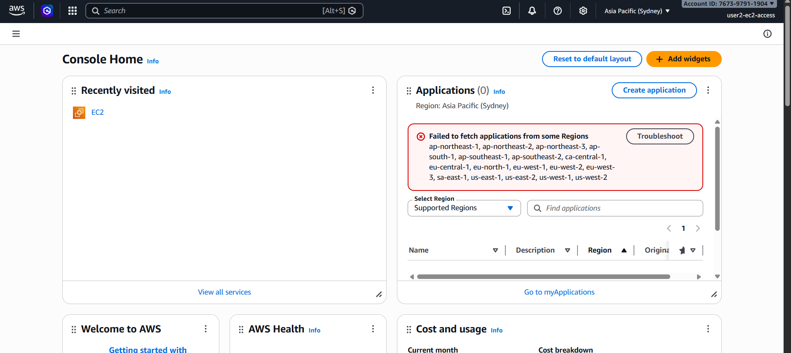

# cloud-assignment
# AWS EC2 Static Website Deployment

## 🌐 Deployed Project Link
http://51.20.204.0

## 📋 Assignment Overview
Hosted a static website on AWS EC2 using Apache (httpd) web server on Amazon Linux 2023.

## 🛠️ Tech Stack
- AWS EC2 (t3.micro, Amazon Linux 2023)
- Apache (httpd) Web Server
- HTML, CSS, JavaScript
- AWS IAM
- Elastic IP

## 📸 Screenshots

### EC2 Instance (AWS Console)

### User 1 Login - No Permissions

### User 2 Login - EC2 Access

## 👥 IAM Users
- **user1-no-access** → No permissions (cannot view EC2 instances)
- **user2-ec2-access** → AmazonEC2FullAccess policy attached

## ⚙️ Steps Followed
1. Launched EC2 instance (Amazon Linux 2023, t3.micro)
2. Allocated and associated Elastic IP (51.20.204.0)
3. Connected via SSH and installed Apache (httpd)
4. Deployed static website to /var/www/html/
5. Created 2 IAM users with different permission levels

## 🚧 Challenges Faced
- Nano editor issue while editing files directly on EC2
- Used SCP to upload HTML file from local machine to EC2
- User 2 region mismatch (Sydney vs Stockholm)

## 🖥️ Instance Details
- **Instance ID:** i-03b156c29cec00774
- **Instance Type:** t3.micro
- **Region:** Europe (Stockholm)
- **Elastic IP:** 51.20.204.0
